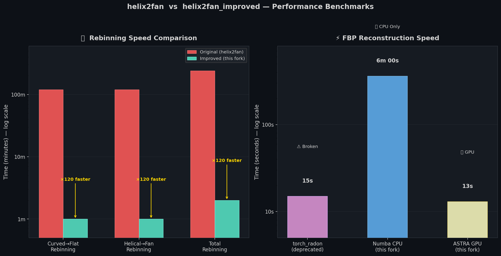
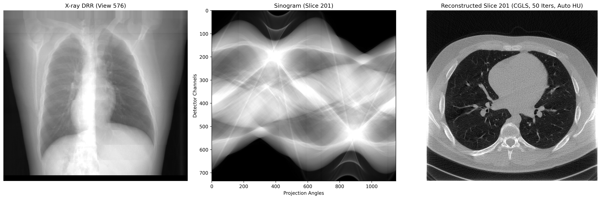

<!-- Badges -->
<div align="center">

[](https://opensource.org/licenses/Apache-2.0)
[](https://www.python.org/)
[](https://github.com/faebstn96/helix2fan)
[](https://doi.org/10.1109/ISBI53787.2023.10230511)

# Helix2Fan Modern

**A high-performance, modernized fork of [helix2fan](https://github.com/faebstn96/helix2fan)**

*Load DICOM-CT-PD helical CT projections → Rebin → Reconstruct — all in one command.*

</div>

---

## Overview

This project provides a complete, modernized pipeline for loading, rebinning, and reconstructing raw helical CT projection data in the [DICOM-CT-PD](https://doi.org/10.1118/1.4935406) format.

It is based on the rebinning algorithm of [Noo et al.](https://doi.org/10.1088/0031-9155/44/2/019), which converts helical CT acquisitions (where the patient table moves during scanning) into equivalent 2D circular fan-beam projections. Once rebinned, standard Filtered Back Projection (FBP) can be applied to reconstruct high-quality CT slice images.

**Compared to the original `helix2fan`:**

| Feature | Original helix2fan | Helix2Fan Modern |
|---|---|---|
| DICOM Sorting | Alphabetical (filename) | Physical (`InstanceNumber`) |
| Curved→Flat Rebinning | ~3 hours `O(N³)` loops | ~1 minute vectorized |
| Helical→Fan Rebinning | ~1 hours `O(N³)` loops | ~1 minute vectorized |
| **Total Rebinning Time** | **~4 hours** | **~2 minutes** |
| FBP Reconstruction (CPU) | `torch_radon` broken | ~6 minutes (Numba) |
| FBP Reconstruction (GPU) | ~15s `torch_radon` | ~13s ASTRA Toolbox |
| Iterative Reconstruction (IR)| Not Supported | SIRT, SART, CGLS, TV-SIRT |
| Reconstruction Dependency | `torch_radon` (deprecated) | ASTRA (GPU) + Numba (CPU) |
| Pipeline | Two separate scripts | Unified single command |
| Setup Complexity | High (torch-radon patching) | Simple pip install |

---

## Performance Benchmarks



> *Benchmarks measured on a typical abdomen CT scan with ~13000 projections . Results may vary depending on scan size and hardware.*

### Rebinning: From Hours to Minutes

The original code implemented both rebinning steps using **triple-nested pure Python loops** — iterating over every combination of (view angle × detector row × detector column). For 13000 projections on a typical detector grid of ~700×64 pixels, this means hundreds of millions of individual Python interpreter calls.

| Step | Original helix2fan | Helix2Fan Modern | Speedup |
|---|---|---|---|
| Curved → Flat Detector | ~3 hours | ~1 minute | **×120** |
| Helical → 2π Fan-Beam | ~1 hours | ~1 minute | **×120** |
| **Total Rebinning** | **~4 hours** | **~2 minutes** | **×120** |

This fork precomputes the entire interpolation coordinate grid **once** using NumPy broadcasting, then delegates the actual interpolation to `scipy.ndimage.map_coordinates` — a compiled C routine that processes the whole array in a single call.

### FBP Reconstruction

| Backend | Time | Status |
|---|---|---|
| `torch_radon` (original) | ~15 seconds | Deprecated — broken on modern PyTorch versions |
| **Numba CPU** (this fork) | **~6 minutes** | Works on any machine, no GPU required |
| **ASTRA GPU** (this fork) | **~15 seconds** | Fastest — production quality, no patching needed |

The ASTRA GPU path delivers essentially the same speed as `torch_radon` — but with zero patching or compatibility issues, natively supporting all ASTRA 2D filters. The Numba CPU path is a full mathematical FBP implementation (cosine weighting → Ram-Lak filtering → fan-beam backprojection) that runs on any laptop or server. 

**Supported Reconstruction Filters:**
You can change the reconstruction filter directly from the command line using `--fbp_filter`.

* **CPU Backend (Numba):** `hann` (Default), `hamming`, `cosine`, `shepp-logan`, `ramp`, `none`.
* **GPU Backend (ASTRA):** Supports all ASTRA native filters natively: `hann` (Default), `ram-lak`, `shepp-logan`, `cosine`, `hamming`, `tukey`, `lanczos`, `kaiser`, `parzen`, `none`.

---

## Key Improvements


### 1. Chronological DICOM Sorting
The original code sorted DICOM files alphabetically by filename, which does **not** always reflect the actual physical acquisition order. This fork reads the `InstanceNumber` tag from every DICOM header before loading pixels, ensuring projections are processed in the exact temporal-physical sequence they were captured by the scanner. This is critical for correct helical geometry reconstruction.

### 2. Vectorized Rebinning (Massive Speedup)
The core rebinning bottleneck in the original was a triple-nested Python loop (over views, detector rows, and detector columns), giving an `O(N³)` complexity. This fork precomputes all interpolation coordinate grids using NumPy broadcasting and delegates the actual interpolation to `scipy.ndimage.map_coordinates`. The result is a dramatic reduction in runtime with identical mathematical output.

### 3. Removed `torch_radon` Dependency
The original reconstruction relied on `torch_radon`, a library that is no longer actively maintained, required manual PyTorch patching to build, and depended on specific CUDA + PyTorch version combinations. This fork eliminates it entirely.

### 4. Intelligent Dual-Mode Reconstruction Engine
At runtime, `main.py` automatically detects which reconstruction backend is available on your system:

```
Runtime Detection
      │
      ▼
  ASTRA Toolbox available?
   ├── YES ──► run_astra_fbp.py  (GPU, FBP_CUDA — fastest)
   │               │
   │            GPU fails?
   │               └──► run_custom_fbp.py (CPU fallback)
   │
   └── NO ───► run_custom_fbp.py  (CPU, Numba JIT — fast)
```

- **`run_astra_fbp.py`**: Uses [ASTRA Toolbox](https://astra-toolbox.com/) `FBP_CUDA` projector for GPU-accelerated fan-beam reconstruction. Reconstructs hundreds of slices in seconds.
- **`run_custom_fbp.py`**: A pure mathematical FBP implementation (cosine weighting → Ram-Lak filtering → fan-beam backprojection) accelerated with [Numba](https://numba.pydata.org/) JIT compilation. No GPU required.

### 5. Iterative Reconstruction (IR) Support
In addition to FBP, the modern pipeline supports GPU-accelerated iterative reconstruction methods (SIRT, SART, CGLS, TV-SIRT) via the ASTRA Toolbox, providing superior image quality for noisy or low-dose scans.

### 6. Automatic Visualization
The pipeline now includes a built-in automated visualization feature that generates a beautiful side-by-side comparison of the X-ray DRR, the perfect Fan-Beam Sinogram, and the Reconstructed CT Slice. The CT slice automatically applies dynamic Hounsfield Unit (HU) windowing for optimal soft-tissue contrast, and the title dynamically reflects the reconstruction method used (e.g., CGLS, 50 iterations).



---

## Project Structure

```
Helix2Fan-Modern/
│
├── main.py                  # Unified pipeline entry point (run this!)
├── read_data.py             # DICOM-CT-PD reader with InstanceNumber sorting
├── rebinning_functions.py   # Vectorized curved→flat and helical→fan rebinning
├── helper.py                # TIFF stack save/load with embedded metadata
│
├── run_astra_fbp.py         # GPU FBP reconstruction via ASTRA Toolbox
├── run_custom_fbp.py        # CPU FBP reconstruction via Numba JIT
├── run_astra_ir.py          # GPU Iterative Reconstruction (SIRT, SART, CGLS, TV-SIRT)
│
├── performance_benchmark.png  # Speed comparison chart
├── LICENSE.md               # Apache 2.0 License
└── README.md                # This file
```

---

## Setup

### Prerequisites
- Python >= 3.8
- (Optional) A CUDA-capable NVIDIA GPU for maximum speed

### Step 1 — Create a virtual environment

```bash
python -m venv venv
source venv/bin/activate       # Linux / macOS
# venv\Scripts\activate.bat    # Windows
```

### Step 2 — Install required packages

```bash
pip install numpy scipy pydicom numba matplotlib tqdm joblib tifffile
```

### Step 3 — (Optional) Install ASTRA Toolbox for GPU acceleration

```bash
conda install -c astra-toolbox astra-toolbox
```

> **Note:** ASTRA Toolbox is strongly recommended if you have an NVIDIA GPU. It can be 10x–50x faster than the CPU fallback for large volumes.

### Step 4 — Download Data

Download DICOM-CT-PD projection data from the public TCIA LDCT dataset:

> [https://doi.org/10.7937/9NPB-2637](https://doi.org/10.7937/9NPB-2637)

This dataset provides raw helical CT projections for over 100 abdomen/chest/head scans.

---

## Running the Pipeline

### Basic Usage

Run the entire pipeline with a single command:

```bash
python main.py --path_dicom '/path/to/DICOM-CT-PD/folder'
```

### What Happens Step by Step

| Step | What it does | Output file |
|---|---|---|
| 1 | Reads and sorts DICOM projections by `InstanceNumber` | *(in memory)* |
| 2 | Rebins curved detector → flat detector | *(optional, with `--save_all`)* |
| 3 | Rebins helical trajectory → 2π fan-beam geometry | `scan_001_flat_fan_projections.tif` |
| 4 | Auto-detects ASTRA (GPU) or falls back to Numba (CPU) | *(auto)* |
| 5 | Runs FBP **or** Iterative Reconstruction on all slices | `scan_001_reconstruction.tif` |

All output is saved to the `out/` folder by default.

### All Command-Line Arguments

**General arguments:**

| Argument | Default | Description |
|---|---|---|
| `--path_dicom` | *(required)* | Path to the folder containing `.dcm` projection files |
| `--path_out` | `out` | Directory where output `.tif` files are saved |
| `--scan_id` | `scan_001` | Prefix name for all output files |
| `--idx_proj_start` | `12000` | First DICOM index to load |
| `--idx_proj_stop` | `16000` | Last DICOM index to load |
| `--save_all` | `False` | Also saves intermediate curved-helix and flat-helix projections |
| `--plot_result`| `all` | Display visualization after run: `all` (default), `sinogram`, `drr`, `reconstruction`, or `none` |
| `--plot_slice` | `-1` | Specific slice index to plot. `-1` automatically selects the middle slice |

**Reconstruction arguments:**

| Argument | Default | Description |
|---|---|---|
| `--reco_method` | `fbp` | Method: `fbp`, `sirt`, `sart`, `cgls`, `tv-sirt` |
| `--fbp_filter` | `hann` | FBP filter *(fbp mode only)*: `hann`, `hamming`, `shepp-logan`, `cosine`, `ramp`, `none` |
| `--iterations` | `100` | Number of iterations *(IR modes only)* |
| `--tv_lambda` | `0.01` | TV regularisation strength *(tv-sirt only)* — higher = smoother |

---

## Iterative Reconstruction (IR)

All iterative methods require **ASTRA Toolbox** and a **CUDA-capable GPU**. Due to the high computational cost of iterative algorithms, running them on a CPU can take several hours per volume, making it highly impractical for general use. Therefore, IR methods are strictly restricted to GPU execution in this pipeline, while FBP remains fully supported on CPU. If ASTRA is not found, the pipeline automatically falls back to CPU FBP.

### Method Comparison

| Method | `--reco_method` | Best For | Speed |
|---|---|---|---|
| **FBP** *(default)* | `fbp` | General use, maximum speed | ~13s (GPU) / ~6min (CPU) |
| **SIRT** | `sirt` | Low-dose CT, noisy data | Moderate (depends on iterations) |
| **SART** | `sart` | Balanced quality and speed | Faster than SIRT per iteration |
| **CGLS** | `cgls` | Fast convergence, fewer iterations needed | Fastest IR convergence |
| **TV-SIRT** | `tv-sirt` | Research quality, edge-preserving | Slowest, highest quality |

### Examples

```bash
# SIRT — ideal for low-dose or noisy scans
python main.py \
  --path_dicom '/data/LDCT/patient_001' \
  --reco_method sirt \
  --iterations 100

# SART — fast, balanced quality
python main.py \
  --path_dicom '/data/LDCT/patient_001' \
  --reco_method sart \
  --iterations 50

# CGLS — fastest convergence among IR methods
python main.py \
  --path_dicom '/data/LDCT/patient_001' \
  --reco_method cgls \
  --iterations 30

# TV-SIRT — maximum quality for research
python main.py \
  --path_dicom '/data/LDCT/patient_001' \
  --reco_method tv-sirt \
  --iterations 200 \
  --tv_lambda 0.005
```

> **Tip on `--tv_lambda`:** Start with `0.01`. Increase it (e.g. `0.05`) for more aggressive noise removal at the cost of some fine detail. Decrease it (e.g. `0.001`) to preserve more texture.

### Example: Custom FBP Filter

```bash
# Reconstruct with the Shepp-Logan filter
python main.py \
  --path_dicom '/data/LDCT/patient_001' \
  --fbp_filter 'shepp-logan'
```

### Example: Reconstruct a Specific Region

```bash
# Reconstruct slices at indices 10000–14000 with all intermediate files saved
python main.py \
  --path_dicom '/data/LDCT/patient_001' \
  --path_out './results' \
  --scan_id 'chest_scan' \
  --idx_proj_start 10000 \
  --idx_proj_stop 14000 \
  --save_all
```

---

## Tips

- **Choosing `--idx_proj_start` / `--idx_proj_stop`:** You need to load enough helical projections to cover at least 360° for the body region you want. A range of ~4000 projections typically covers one rotation. Loading too few projections causes streak artifacts at the top and bottom slices.
- **Selecting a region of interest:** Each scan has tens of thousands of projections. Start with the default range (12000–16000) and adjust based on which anatomical region you're interested in.
- **Flying Focal Spot (FFS):** The parameters `--dangles`, `--dz`, `--drho` are correctly extracted from the DICOM headers (as in the original project) but FFS correction is not yet applied during backprojection. Reconstruction quality is still reasonable without it.
- **Memory:** Loading 13000 projections at full resolution can use several GB of RAM. Use a smaller range if memory is limited.

---

## Dependencies

| Package | Purpose |
|---|---|
| `numpy` | Core numerical arrays |
| `scipy` | Vectorized interpolation (`map_coordinates`) |
| `pydicom` | Reading DICOM-CT-PD files and headers |
| `numba` | JIT-compiled CPU FBP backprojection |
| `tifffile` | Saving multi-page TIFF stacks |
| `tqdm` | Progress bars |
| `matplotlib` | Result visualization |
| `joblib` | Parallel processing utilities |
| `astra-toolbox` | *(Optional)* GPU-accelerated FBP + Iterative Reconstruction (SIRT, SART, CGLS, TV-SIRT) |

---

## License & Attribution

This project is distributed under the **[Apache License 2.0](./LICENSE.md)**.

It is a **derivative work** of the original [`helix2fan`](https://github.com/faebstn96/helix2fan) repository by Fabian Wagner et al. All modified files carry a notice of the changes made, in compliance with Apache 2.0 Section 4(b).

### Citing the Original Work

If you use this pipeline in your research, please cite the original `helix2fan` authors' publication presented at **ISBI 2023** (Best Paper Award):

```bibtex
@inproceedings{wagner2022dual,
  title={On the Benefit of Dual-domain Denoising in a Self-Supervised Low-dose CT Setting},
  author={Wagner, Fabian and Thies, Mareike and Pfaff, Laura and Aust, Oliver and Pechmann, Sabrina and Maul, Noah and Rohleder, Maximilian and Gu, Mingxuan and Utz, Jonas and Denzinger, Felix and Maier, Andreas},
  booktitle={2023 IEEE 20th International Symposium on Biomedical Imaging (ISBI)},
  pages={1--5},
  year={2023},
  organization={IEEE},
  doi={10.1109/ISBI53787.2023.10230511}
}
```

Also cite the underlying public CT dataset:

```bibtex
@misc{mccollough2020low,
  title={Low Dose CT Image and Projection Data (LDCT-and-Projection-data) (Version 5)},
  author={McCollough, C and Chen, B and Holmes, D and Duan, X and Yu, Z and Yu, L and Leng, S and Fletcher, J},
  journal={The Cancer Imaging Archive},
  year={2020},
  doi={10.7937/9NPB-2637}
}
```

And cite the rebinning algorithm itself:

```bibtex
@article{noo1999single,
  title={Single-slice rebinning method for helical cone-beam CT},
  author={Noo, Frederic and Clackdoyle, Rolf and Mennessier, Catherine and White, Timothy A and Roney, Timothy J},
  journal={Physics in Medicine & Biology},
  volume={44},
  number={2},
  pages={561},
  year={1999},
  publisher={IOP Publishing},
  doi={10.1088/0031-9155/44/2/019}
}
```
